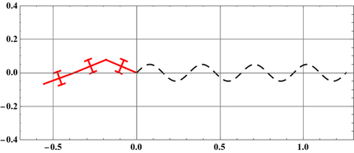

# Trajectory Tracking using an Inverse Dynamics Controller

## What is in this repository?

I this repository, I present my implementation to the inverse dynamics controller presented in [1]. The controller in [1] allows wheeled planar snake robots with any number of links to traverse desired trajectories.

## What is a snake robot?

A snake robot is a series of rigid links connected via revolute joints as shown in the figure below. At each of the snake's links, a passive  wheel is mounted. The shape of the snake robot, $r=(\sigma_1, \sigma_2)$, is controlled by means of revolute actuators connected on the snake joints. The controller presented in this repository solves for the actuator torques that allow the head of the robot, $(x,y)$, to traverse any desired trajectory. 

  
  
Three-link wheeled snake robot

## Example

The developed controller is validated on a three-link snake robot. The head of the snake robot, i.e., tip of the first link, is required to traverse a sinusoidal trajectory $(x,y) = (0.1 t, 0.05 Sin(2 t))$.

#### Simulation:

  </a>
  
Three-link snake robot traversing a sinusoidal trajectory

## References

[1] F. Matsuno and H. Sato, "Trajectory Tracking Control of Snake Robots Based on Dynamic Model," Proc. of IEEE International Conference on Robotics and Automation, Barcelona, Spain, 2005, pp. 3029-3034.